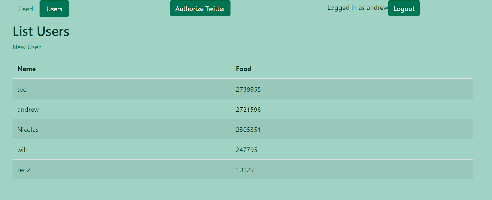
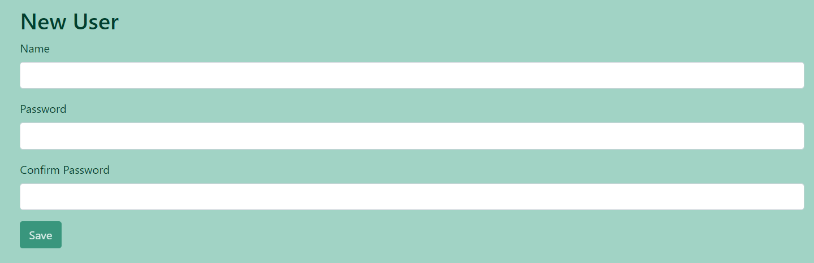

**When**: March 2021 - April 2021  
**Developed in**: React, JavaScript, Phoenix, Elixir
### About

Monster Browser is an idle incremental game in which you acquire monsters, gather food, and train your monsters to make them better at gathering food.
It was developed using the single-page application model to meet the requirements for my team's web development class final project. The website relied on JavaScript/CSS for the React frontend and Elixir/Erlang code for the Phoenix backend. It also utilized the Twitter API to allow Twitter users to boost your in-game progress by interacting with a tweet sent through the game. We deployed the site from our own server instance to a custom domain using nginx.

### Contributions
* Designed and implemented Twitter API features
* Collaborated over Zoom and "pair programmed" with groupmates to implement app functionality
* Brainstormed game concepts and contributed ideas to ensure our app would be fun, interesting, and feasible
* Acquired Twitter development account

### Lessons & Takeaways

Our web dev final project was the culmination of everything we had learned and worked on in our assignments during the semester. By that point in the course, we were experienced in deploying websites with nginx and building single-page applications in Phoenix and React, and we were now tasked with building our most complex application yet. This project took place during the pandemic, so we spent a lot of time collaborating over Zoom to get it done. Our two biggest challenges were tracking monster progress at all times and writing the Elixir code that interacted with the Twitter API, but we had a very capable team, and with the time and effort we put into the project, it was a great success.

