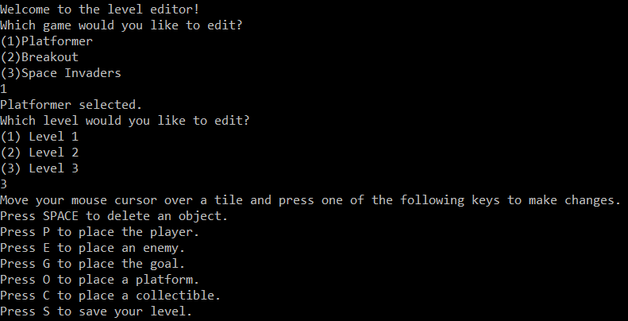
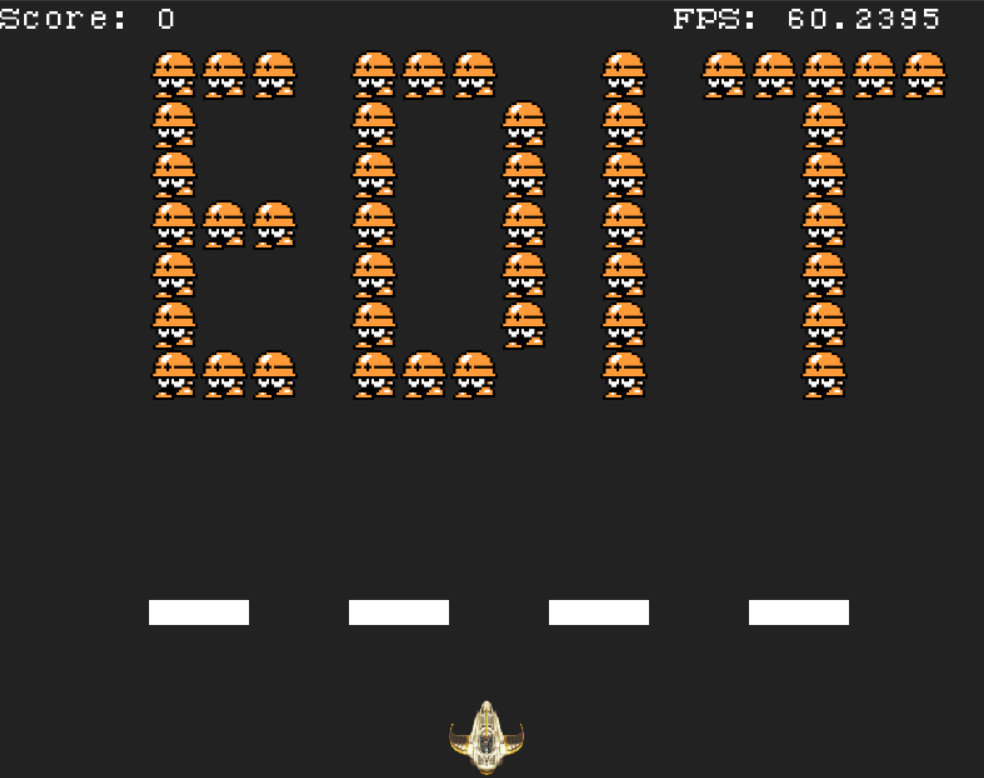
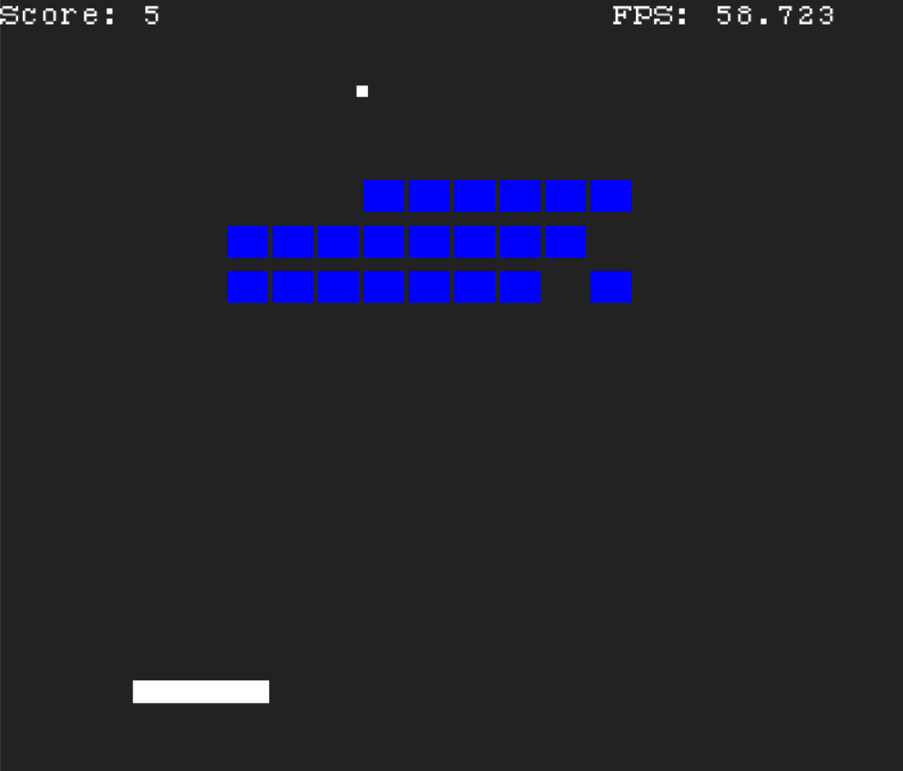

**When**: January 2020 - April 2020  
**Developed in**: C++, SDL  
**Github repo available [here](https://github.com/willpbridges/custom-game-engine)**
### About

This was a semester-long group project for my Building Game Engines class at Northeastern. The first iteration of the engine simply allowed you to play a version of Breakout, but the final engine also featured a 2D platformer, a Space Invaders clone, and a GUI level editor. Some key features of
the engine include resource management, game object components, math and physics
systems, and frame rate caps.

### Contributions
* Led project development and organized milestone goals
* Designed and programmed core mechanics for each game in the engine
* Integrated code from in-class labs to implement key features such as resource management, physics, collision, and frame rate caps
* Extensively collaborated with team to finish project after COVID-19 interrupted the semester and forced us to work remotely

### Lessons & Takeaways

Our custom game engine was easily the most in-depth C++ project I've developed, and it was also one of the most challenging and rewarding projects I worked on in college. There were a lot of interesting problems to solve. We had to make 3 functional games using the same base engine code and component systems, and we also had to make sure the games felt good and had multiple playable levels. COVID was a massive and unexpected obstacle, and it forced us to complete some of the most challenging work remotely. We spent countless hours during the pandemic building the level editor, porting over our old Breakout code to an updated engine, and fixing numerous bugs before milestone deadlines. Overall, I think the project was a huge success and I'm very glad to have worked on it.

