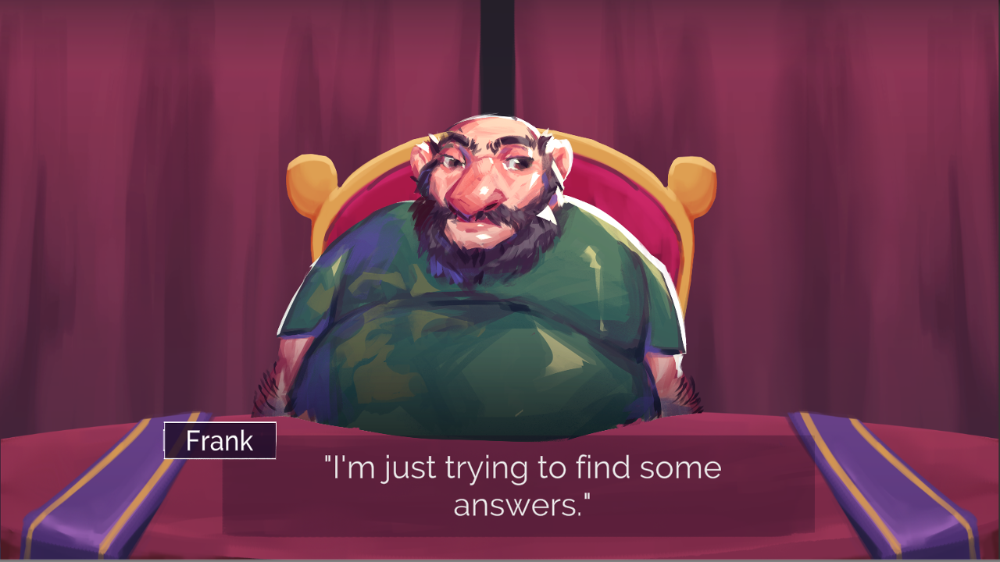
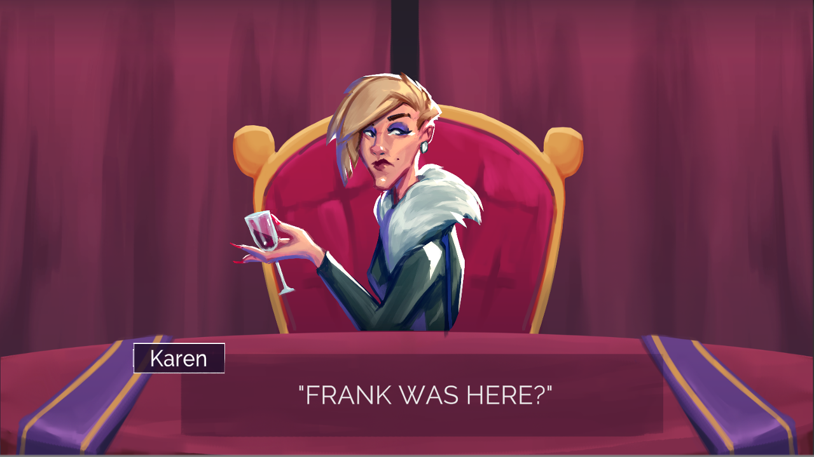
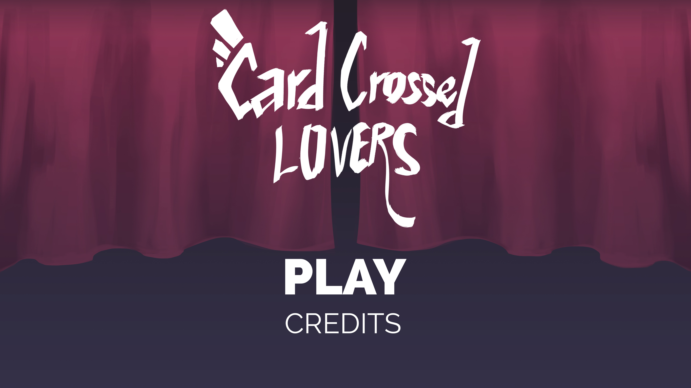

**When**: October 2019  
**Developed in**: Unity, C#
### About

Card Crossed Lovers is a visual novel with puzzle elements and multiple endings. The player encounters a husband and wife with a troubled marriage and must perform a tarot reading for each spouse. The player is given a three-card "Past, Present, Future" spread, and the order in which you place each character's cards determines the endings for that character.

### Contributions

* Designing and implementing the tarot card system in Unity
* Writing C# scripts for card movement and particle effects
* Proofreading and editing the narrative script, which was integrated into the game using the Ink scripting language

### Lessons & Takeaways

Card Crossed Lovers was developed for a weeklong game jam hosted by the Northeastern game dev club. It was a unique experience because while I've made both long-term games and weekend jam games, this is the only game I've made over one full week. We were still under a tight deadline, but since we had 7 days as opposed to 48 hours, working on the game was a lot more relaxed, and our initial scope for the project ended up working out nicely. Our tarot card system gave me experience in developing mouse-based interfaces in Unity, and I learned a little bit about incorporating narrative engines like Ink into games. I also had the privilege of working with our artist and composer, who are both extremely talented.

