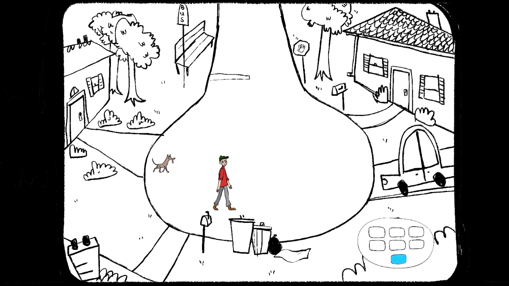
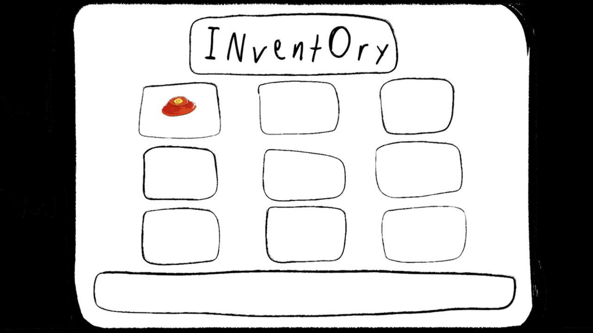

**When**: January 2019  
**Developed in**: Unity, C#

<video width="720" height="480" controls>
  <source src="trailer.mp4" type="video/mp4">
</video>

### About

Dogs Day is a 2D narrative-driven adventure game. You play as a reclusive PhD student who gets brought out of his shell after meeting three lost dogs. The game loop consists of finding a special item for each dog and bringing it to a specific location, which will trigger an event that leads to the dog finding its way home.

### Contributions

* Writing C# scripts to handle inventory management and dog behavior
* Working for two days straight to develop the game during the Global Game Jam
* Actively participating in brainstorming session to create a narrative and game mechanics

### Lessons & Takeaways

This is one of my earliest Unity projects, and I learned a lot from it. As a sophomore in 2019, I participated in my second Global Game Jam, and it was a huge improvement over my freshman year. My 2018 team consisted of around 10 people, including some very talented programmers and designers, but as we found out, working with 10 people at a 48-hour game jam can be counterproductive unless you really know what you're doing. We struggled with scope and defining the core elements of our game and ended up wasting a lot of time spinning our wheels. We also ran into massive headaches with Github. By contrast, my 2019 Global Game Jam went incredibly smoothly. My new team was half the size, with only 3 programmers and 2 artists, and we knew exactly what our game was going to be very early on. We were extremely productive throughout the weekend and walked away with something we were proud of. Additionally, with slightly more Unity experience under my belt and a more defined role on the team, I felt like I was able to contribute more.