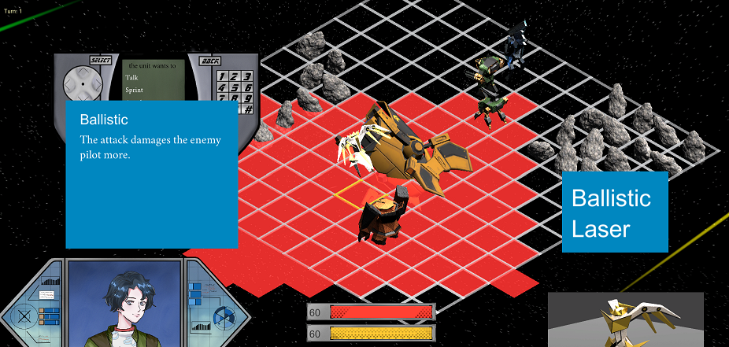
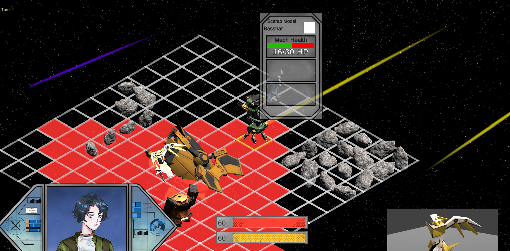

**When**: October 2020 - January 2021  
**Developed in**: Unity, C#
### About
Habit of Force is a game created by Northeastern University professor Brandon Sichling.
Inspired by games like Fire Emblem: Awakening, Habit of Force combines tactical turn-based combat with a support system that emphasizes the personal relationships between the units in your squad. You can visit the game's website [here](https://www.habitofforcegame.com/).

### Contributions
* Preparing the game to be showcased at events such as the Boston Festival of Indie Games and Tokyo Indies
* Independently reading and learning the large pre-existing codebase
* Tracking down and fixing bugs in scripts to bring the game to a playable state
* Implementing mechanics, animations, and UI elements for the battle mode
* Filling out missing or broken functionality in scripts and adding new functionality based on code already in place
* Helping onboard junior developers and holding project meetings to collaborate while implementing gameplay features

### Lessons & Takeaways

Habit of Force gave me valuable experience in joining a project midway through
development and having to read and comprehend a large codebase to get up to speed. It was intimidating at first, but I soon gained a pretty solid understanding of the code and figured out what worked and what didn't. I was then able to take this knowledge and make progress on my first action items, eventually improving the existing functionality and then adding new mechanics to the gameplay. Two freshmen programmers were brought on at the same time as me, and I helped them understand the codebase so they could accomplish their assigned tasks. Development had been paused while the game transitioned to the new development team, so being able to make tangible progress and leave our mark on the game felt great.

<video width="720" height="480" controls>
  <source src="trailer.mp4" type="video/mp4">
</video>