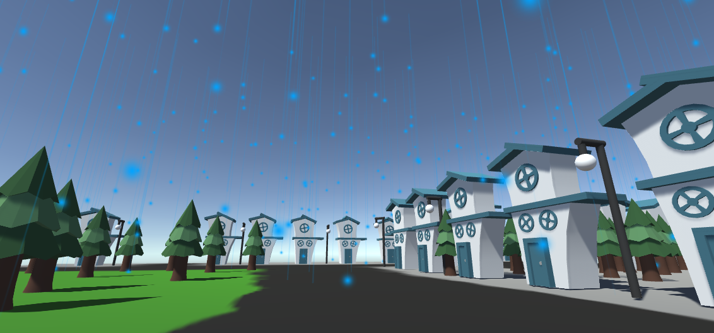

**When**: January 2020 - April 2020  
**Developed in**: Unity, C#
### About

In my Level Design and Game Architecture class at Northeastern, we practiced using real-world architectural theory to create meaningful spaces in games. I worked with a team throughout the semester to develop level design patterns inspired by Christopher Alexander's book on architecture and urban design, *A Pattern Language.* We then used these patterns to create our Unity prototypes.

### The Process

Each week in class, we were given a prompt and had to find 10 games that satisfied the prompt. The prompt could be to find games that used a certain design technique or caused a certain emotion within the player. We then looked at how each game fulfilled the prompt and derived a more focused list of patterns that we discovered. Finally, we picked a pattern to base our level around, and we also had to imagine a design problem that said pattern would solve. 

Over the course of the next week, we would brainstorm a scenario, create the art assets we needed, and then build our level in Unity. I was one of the team's dedicated Unity developers, and I also designed the scenario for a couple of assignments. Our main goal was building the level itself, not programming mechanics, so most assignments just used a simple first-person player controller to walk through the level.

### Example Projects

**Final Project: Specterscope**

Design document available [here](https://docs.google.com/document/d/1dsCQ9n7TdupV1j4I2OuD0KfaqzETd72vmUFwQPQrGTI/).

This was our final project for the class, which was interrupted somewhat by the pandemic forcing us off-campus and into remote work. The idea behind the project was to gather several patterns created by our class throughout the semester and combine them to create a pitch for a full game. We then used our pitch to develop one level that would successfully showcase all of the patterns we selected.

The Pitch: Specterscope
* Play as a paranormal investigator, going to different haunted venues and solving the mysteries within.  
* Rogue-like: upgrade the character or collect vital resources inside each locale
* Each location is procedurally generated as the player explores, creating a layout from a toolbox of several rooms, some with special features (one room may allow the player to heal, or another may reveal the location of a key piece of evidence).

Demo level info:
* Consists of a one bedroom house with a living room, study, bathroom, kitchen, and a patio.
* Case clues highlighted in different ways throughout the house
* Clues reveal the presence of an evil spirit in the TV, and begin to outline a method of exorcizing it. 
* The TV progressively tries to take you over until you can complete the ritual; in practice you have a 10 minute time limit. 
* Collectible item in the bedroom under the bed that can pacify the TV and give you another two minutes and a special lead in the wall of the study. 
* The ghost of the old woman is also in the house and will periodically become aggressive: it can be pacified with the Specterscope.   

**Theme Pattern: Alien Village**

 

In this level prototype, you play as a space explorer looking for habitable planets after Earth has been ravaged by climate change and war. You find a village and realize the planet you've discovered is home to a thriving alien civilization. You explore the village, making note of various discoveries along the way:
* Advanced architecture unlike anything on Earth, with a towering Ziggurat visible on the horizon
* Alien trees and electric lamps lining the town's roads
* A communal well at the center of town
* The Ziggurat is actually floating in the sky beyond the village borders, and there are hovercrafts parked outside and fireworks going off. You deduce the villagers must be gathered at the Ziggurat for some sort of festival.

At the end of your mission, you must decide whether to report that the planet is habitable, or lie to your superiors so that the alien civilization is left alone. Our thought process behind this pattern was this: As a designer, if you base your game world around a setting with a lot of narrative baggage, you should properly address the themes and implications of that setting rather than ignoring them and just trying to appeal to the player with aesthetics. Our goal was to design a world with cool aesthetics while also examining the ramifications of humans trying to colonize other planets.   

**"Empty Nest" Pattern: Lost Dog**

The goal of this level was to demonstrate how to make a player feel lonely in a familiar environment. We achieved this in the following ways:
* Your dog runs away when you accidentally throw the ball too far playing fetch, and you can't find him
* You trigger an emotional music cue when you walk by the local park (a cutscene would play here featuring memories of your dog), and it starts raining
* The initially charming neighborhood becomes daunting as you realize you can't tell anything apart amidst the endless rows of cookie-cutter houses
* You reach a dead end where you find the ball but not your dog

Within the context of a full game, you would probably need to take more time and effort to elicit an emotional response from the player and make it feel earned, but we felt this short level concept effectively communicated our goals.