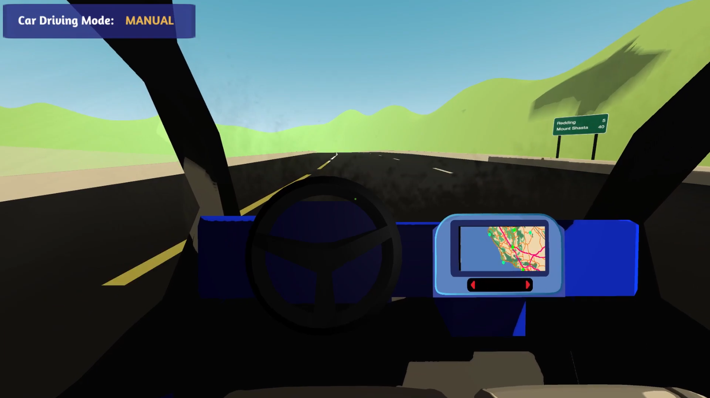
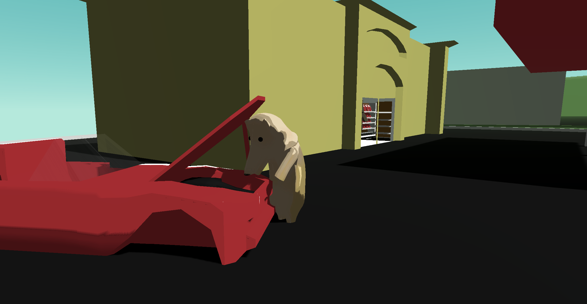
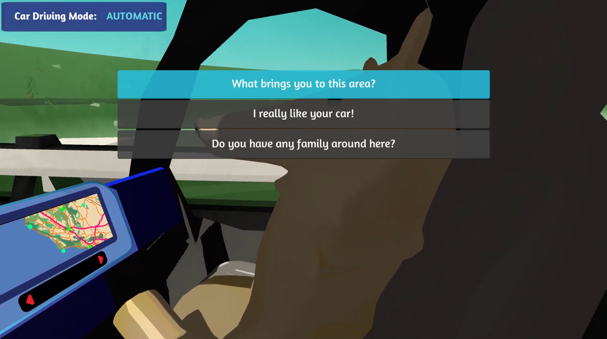
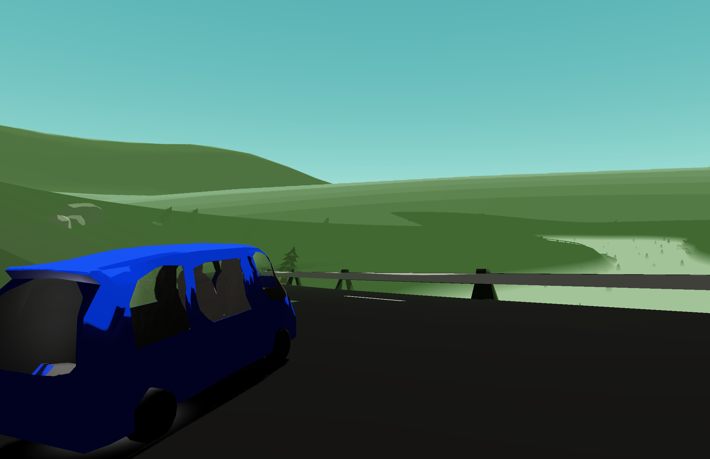

**When**: September 2020 - April 2021  
**Developed in**: Unity, C#  
**[Available on itch.io](https://elijahcobb.itch.io/road-trip)**

<video width="720" height="480" controls>
  <source src="driving.mp4" type="video/mp4">
</video>

### About
Over the course of my senior year, I worked remotely with three other team members to design and program a complete, polished game in Unity for our game design capstone class. The result was Road Trip: a first-person, narrative-based adventure game with laid-back driving gameplay. Road Trip features the following:
* A charming narrative with a compelling mystery 
* Adorable animal characters
* Automatic and manual driving modes, which you can switch between at any time
* An interactive dashboard with 4 radio stations, each one featuring a different song from our original soundtrack
* Good vibes

### Contributions
* Writing C# scripts to create the pathfinding system for automatic driving and designing the pathways on each route
* Playtesting and fixing bugs before each build submission for in-class milestones
* Collaborating remotely over Zoom and Discord throughout school year
* Reaching out to our composer to secure original music for game
* Keeping project scope in check and making sure team stayed focused on essential parts of the game

### Lessons & Takeaways

Road Trip felt like a big step forward for me as a game developer. As it was a year-long capstone project, it was the longest-term game I've worked on to date, and I had to work with my team to brainstorm, develop, and polish the game so it could be considered completed and shipped by the end of the year. My Unity experience was very beneficial to making this project go as smoothly as it did, and I was able to build on that experience to make something I was happy with. There were plenty of programming bugs and design challenges to tackle, but I was always confident in my ability to work out a solution in Unity. This project also taught me the importance of responding to playtest feedback and polishing your game to the best extent that you can. In a smaller-scale class project, you can get away with some incomplete features and jankiness, but if you're shipping a game, you have to make the user experience as smooth as possible, and also patch up any places in your game where the player can fall out of the world. Overall, I'm very happy with how the game turned out, especially since it was developed remotely during a pandemic.

